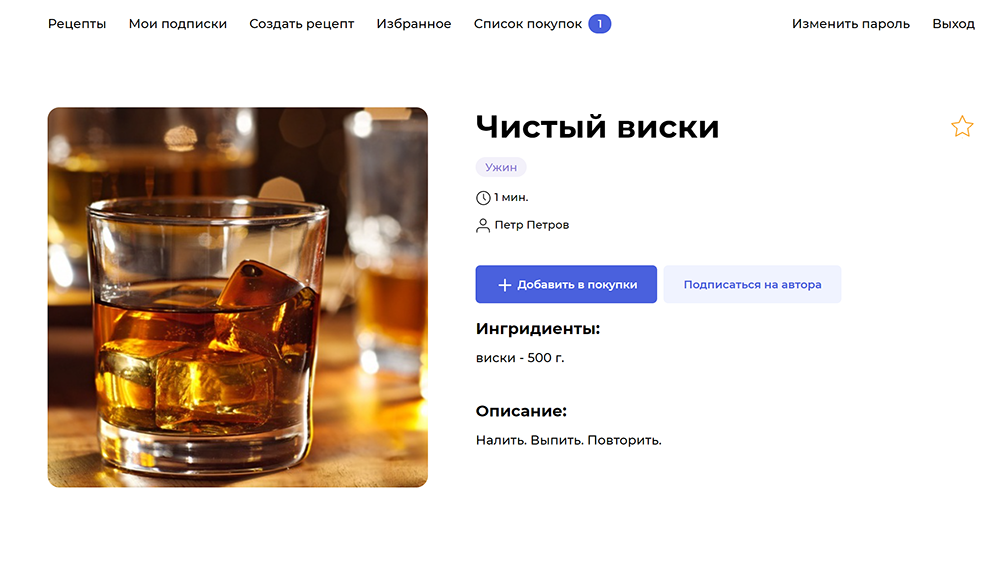

# foodgram (Продуктовый помощник)


### Описание

Сайт, на котором пользователи публикуют рецепты, добавляют чужие рецепты в избранное и подписываются на публикации других авторов. Сервис «Список покупок» позволяет пользователям создавать список продуктов, которые нужно купить для приготовления выбранных блюд.

### Технологии

Python 3.7 Django 3.0.5

### Запуск проекта dev-режиме

-   Создайте и активируйте виртуальное окружение
-   Установите зависимости из файла requirements.txt

```
pip install -r requirements.txt
```

-   Выполните миграции:

```
python3 manage.py makemigrations
```
```
python3 manage.py migrate
```

-   Соберите статику:

```
python3 manage.py collectstatic
```

-   Загрузите фикстуры:

```
python3 manage.py loaddata fixtures.json
```

-   Добавьте администратора (опционально):

```
python3 manage.py createsuperuser
```

-   В папке с файлом manage.py выполните команду:

```
python3 manage.py runserver
```

### Скриншоты


---

---

---


### Автор

walkgo
